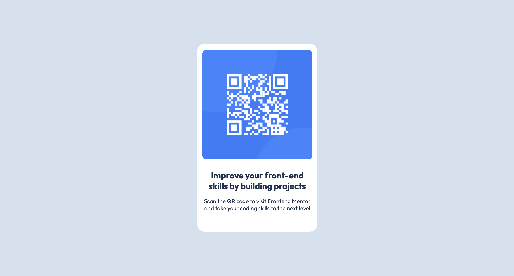

# Frontend Mentor - QR code component solution

This is a solution to the [QR code component challenge on Frontend Mentor](https://www.frontendmentor.io/challenges/qr-code-component-iux_sIO_H). Frontend Mentor challenges help you improve your coding skills by building realistic projects. 

## Table of contents

- [Overview](#overview)
  - [Screenshot](#screenshot)
  - [Links](#links)
- [My process](#my-process)
  - [Built with](#built-with)
  - [What I learned](#what-i-learned)
  - [Continued development](#continued-development)
  - [Useful resources](#useful-resources)
- [Author](#author)
- [Acknowledgments](#acknowledgments)

## Overview

### Screenshot
Desktop

Mobile

### Links

- Solution URL: https://github.com/ownedbyanonymous/qr-code-component-main
- Live Site URL: https://qr-code-component-main-delta-fawn.vercel.app/

## My process

### Built with

- Semantic HTML5 markup
- CSS
- Flexbox
- Build for desktop first

### What I learned

While tackling this exercise l learnt :
1. How to center images and text using ***text-align***. You can center images or text inside a block-level parent by setting the property text-align to center in the parent container. This centers the children.
2. How to center divs using ***Flexbox***. To achieve this you need to declare the property *display: flex* on the  parent container. Give the parent container a width and height and align-items and justify-content. 
3. How to deploy websites using Vercel.
4. How to write good commits.

### Continued development

Areas that l need to focus on more include: 
1. Deploying websites using Vercel and understanding the Vercel pipelines
2. Writing good commits, pull requests and using correct naming conventions for branches
3. Using git and GitHub
4. HTML and CSS

### Useful resources

- [Resource 1](https://www.freecodecamp.org/news/how-to-center-an-image-in-a-div-css/) - This helped me in understanding how to center divs and images using text-align, margin and flexbox.
- [Resource 2](https://www.freecodecamp.org/news/writing-good-commit-messages-a-practical-guide/) - The was resource provided excellent details how to write good commits that can easily be understood by others and my future self.
- [Resource 3](https://dev.to/mroman7/a-complete-guide-of-responsive-web-design-using-css-rem-and-em-units-4j6k) - This was useful in helping me understand how to make my content responsive using responsive units like rem and em and in understanding the difference between the different units of measurements in CSS.

## Author

- Frontend Mentor - [@ownedbyanonymous](https://www.frontendmentor.io/profile/ownedbyanonymous)

## Acknowledgments
My biggest thanks goes to Tiger and Miraya Abrodi for the motivation.
Thank you to all wonderful people of the Internet who choose to share their knowledge freely. 
